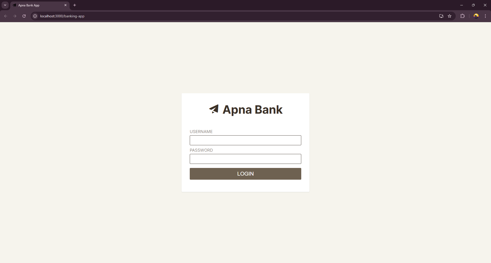

<<<<<<< HEAD
# Banking App in ReactJS



The user is a bank employee who manually manages the bank's accounts.
He does the creation of account manually using the account holders name and sets the initial balance of the account if possible.

He also does the withdrawal and deposit manually for each account.
He also does the transfer of balances if there are requests for it.
Your task is to help this poor employee out by creating a simple admin banking app

[Live demo of Banking App](https://jeffdelara.github.io/banking-app/)

## Objective
A banking app created with ReactJS.

## Demo Account Credentials

Use the following credentials to test the app.

### For Admin
```
email: admin@admin.com
password: abc123
```

### For Client
```
email: client@client.com
password: abc123
```

[Live demo of Banking App](https://jeffdelara.github.io/banking-app/)
=======
# Apna-Bank
Bank4U is a full-stack banking web application designed for users to securely manage their finances online. Built with a modern technology stack—React for the frontend, Node.js for the backend, and MongoDB for data storage—it provides a smooth, responsive, and user-friendly experience.
>>>>>>> 7ae3e29b895c5e8c7ac55eb713d6b3962fe5d8bd
